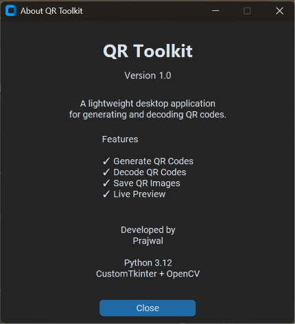

# QR Toolkit

A lightweight desktop application for generating and decoding QR codes with a clean and modern interface.


## Features

- Generate QR Codes
- Decode QR Codes
- Save QR codes as PNG or JPEG
- Copy decoded text to clipboard
- Dark Mode UI

## Screenshots

### Generate Page


### Decode Page


### About Window



## Installation

### Option 1: Download the Executable (Recommended)

1. Download `QRToolkit.exe` from the latest release.
2. Open `QRToolkit.exe`.
3. If Windows blocks the application then:
   - Open Windows Security.
   - Navigate to App & browser control.
   - Select Smart App Control.
   - Turn Smart App Control Off.
   - Launch QRToolkit.exe again.

> **Note:** Smart App Control is a Windows security feature that blocks applications without an established reputation. Only disable it if you trust the executable.

> No python installation is required.

### Option 2 - Run from Source

#### Clone the repository

```bash
git clone https://github.com/yourusername/qr-toolkit.git
cd qr-toolkit
```

#### Create a virtual environment

```bash
python -m venv .venv
```

#### Activate it

Windows CMD:

```cmd
.venv\Scripts\activate
```

Powershell:

```powershell
.venv\Scripts\Activate.ps1
```

Git Bash:

```bash
source .venv/Scripts/activate
```

---

### Install Dependencies

```bash
pip install -r requirements.txt
```

### Run the application

```bash
python src/main.py
```

## Building the Executable

```bash
pyinstaller --onefile --windowed --name "QRToolkit" src/main.py
```

The executable will be located in

```
dist/
└── QRToolkit.exe
```

## Author

**Prajwal**

If you found this project useful, consider giving it a ⭐ on GitHub.

## License

This project is licensed under the MIT License.
